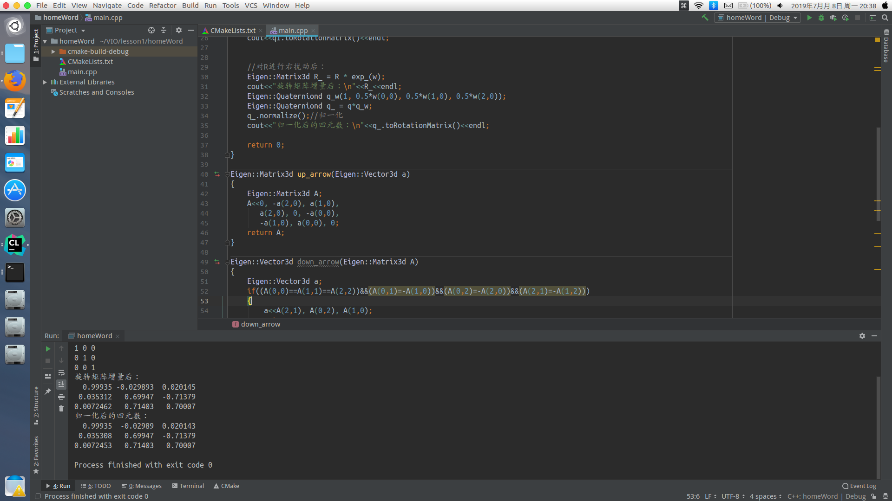

## Homework
1. 视觉与 IMU 进行融合之后有何优势？有哪些常见的视觉 +IMU 融合方案？有没有工业界应用的例子？
> 开放性回答
> 视觉在处理纯旋转或快速移动时容易失败，而这对于高频的IMU来说是长处，反而言之，IMU的积分误差很容易积累，使误差越来越大，在视觉和imu结合后，可以处理相机的短暂过曝、快速移动等；
> 另外imu的加入可以使系统多了3自由度的可观性
2. 无穷小量用R和q更新方法的区别
- R←Rexp($\omega$^)
- q←q⊗[1,1/2$ω$]^T   
> 答：随机生成一个旋转(R或q)，再通过上述两种方法，使用无穷小量更新该旋转，由下结果得出，R和q的表达是完全一致的
> q需要归一化才能表示旋转

3. 推导公式
> 利用了R的两个伴随性质
> 在slam过程中，我们会经常遇到对某个旋转或3D坐标进行求导，做优化